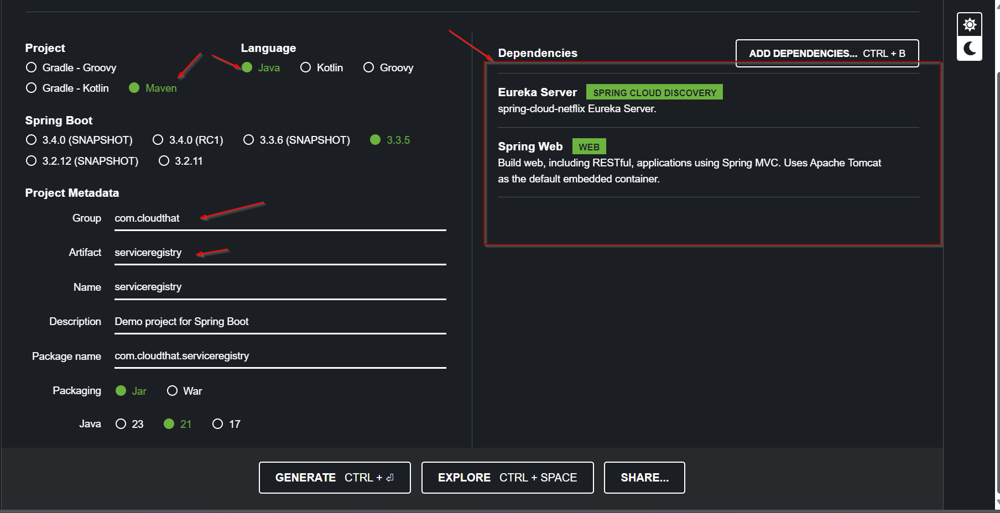
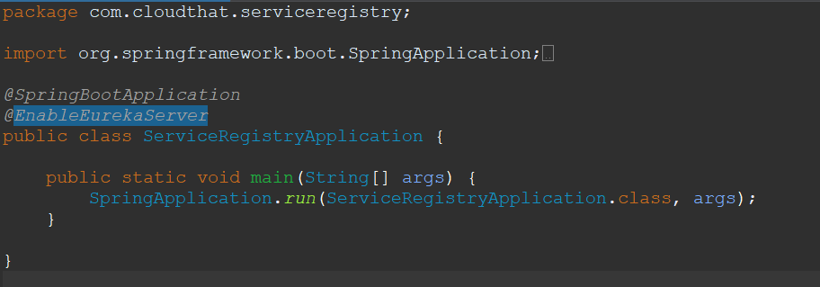
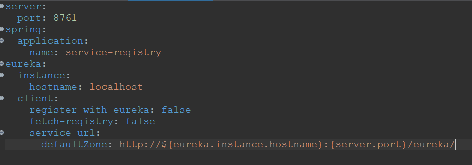
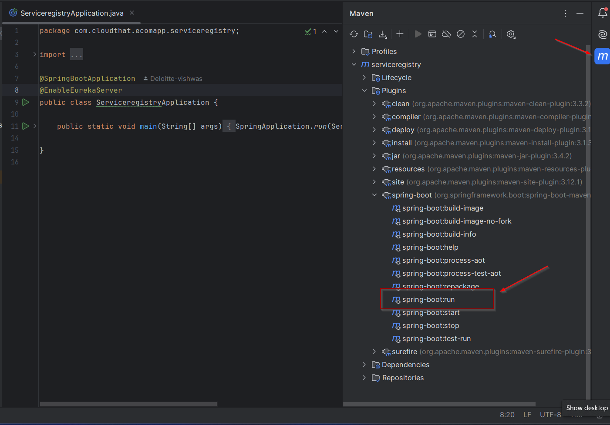
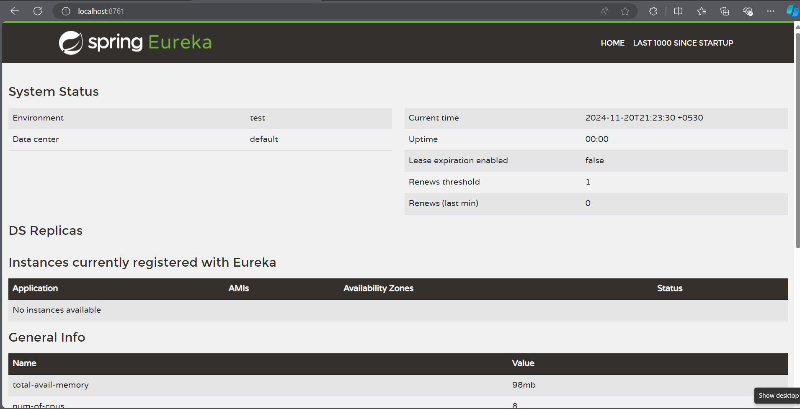

# Lab: Creating Service Registry for Ecommerce App

## Tasks:

### Task 1: Generating Template from spring initializer

* visit the [spring initializer](https://start.spring.io)
* Add the dependencies
  

### Task 2: Open the project in intellij
* Convert `application.properties` to `application.yaml` 

### Task 3: Enable Eureka Server
* In Application File - `@EnableEurekaServer`
   

### Task 4: Add Configuration in application.yml
set `server.port` to `8761`

## Output:

Now you can check the service registry using the above address

visit https://spring.io/guides/gs/service-registration-and-discovery for more