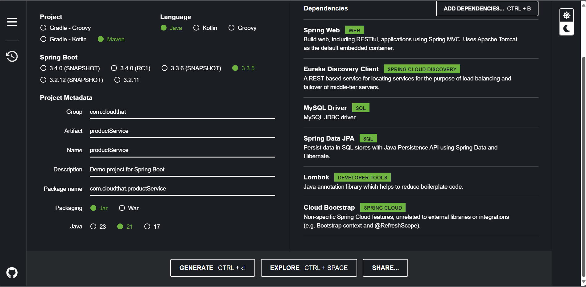
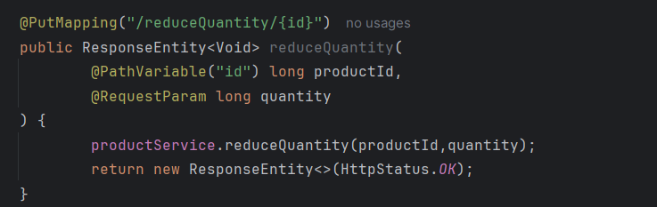
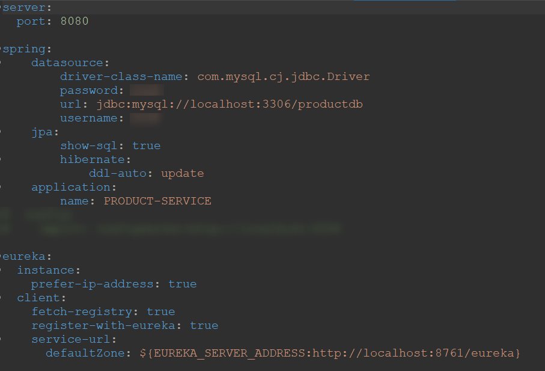
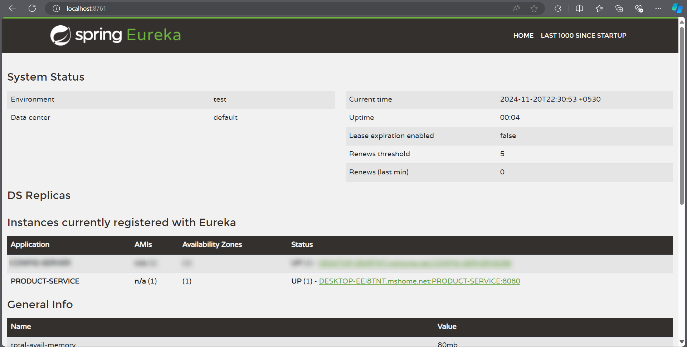

# Lab: Creating Product Service for Ecommerce App

## Tasks

### Task 1: Generating Template from spring initializer

* visit the [spring initializer](https://start.spring.io)
* Add the dependencies
  * Spring Web
  * Eureka Client
  * Lombok
  * Data JPA
  * Mysql
  * Cloud Bootstrap

  

### Task 2: Open the project in intelliJ
* Convert `application.properties` to `application.yaml` 
* Set `server.port` to `8080`

### Task 3: Creating Product Service

* Create – endpoints as in spring boot app as you created earlier
* Product Resource has the fields as below
  * productId
  * productName
  * price
  * quantity
  * category
* Also add an endpoint
  
 

### Task 4: Add product Service as Eureka Client

test the product service and service registry

## Output

