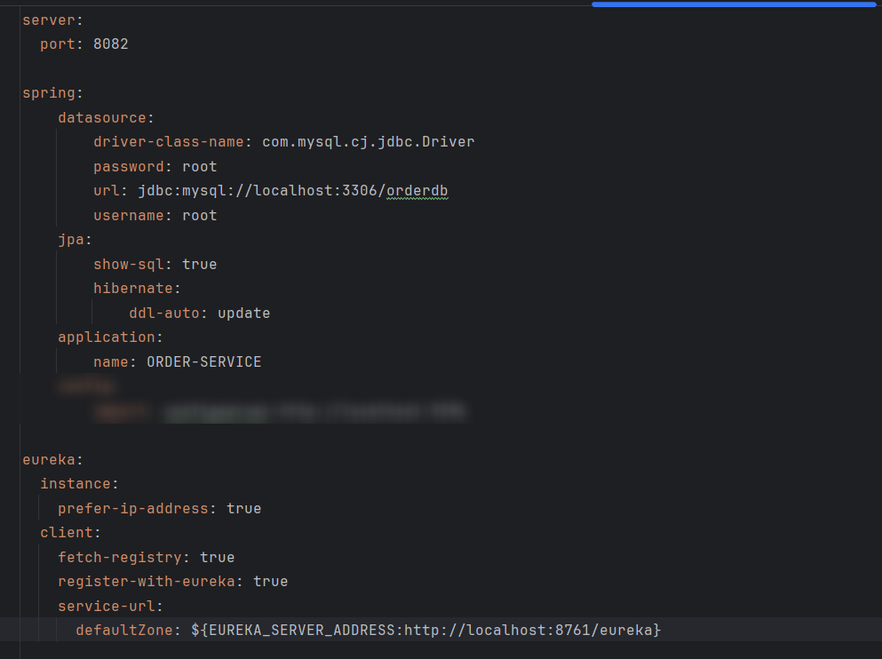
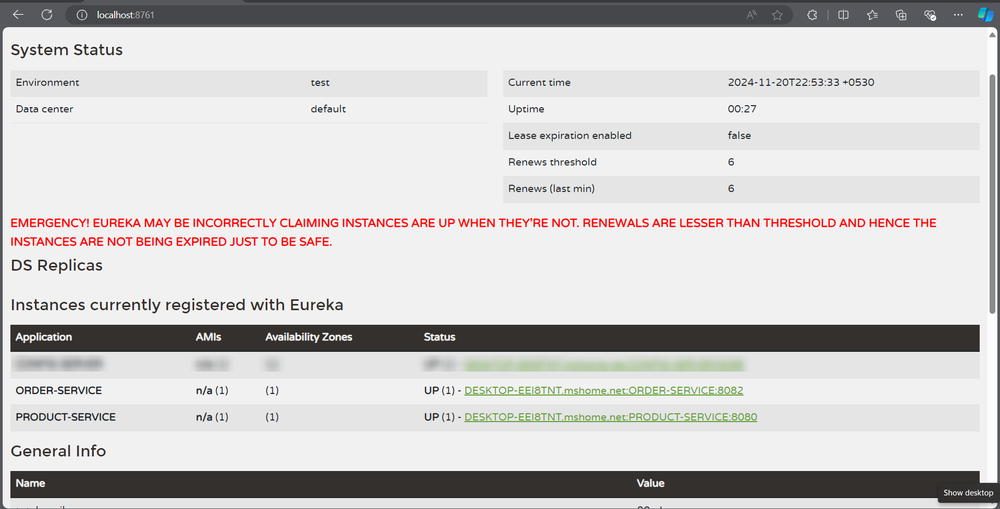

# Lab: Creating Order Service for Ecommerce App

## Tasks

### Task 1: Generating Template from spring initializer

* visit the [spring initializer](https://start.spring.io)
* Add the dependencies
  * Spring Web
  * Eureka Client
  * Lombok
  * Data JPA
  * Mysql
  * Cloud Bootstrap

  

### Task 2: Open the project in intelliJ
* Convert `application.properties` to `application.yaml` 
* Set `server.port` to `8082`

### Task 3: Creating Order Service
* Create – endpoints as in spring boot app as you created earlier
* Order Resource has the fields as below
  * orderId
  * productId
  * amount
  * quantity
  * orderStatus
  * orderDate

### Task 4: Add order Service as Eureka Client

test the order service and service registry

## Output:

