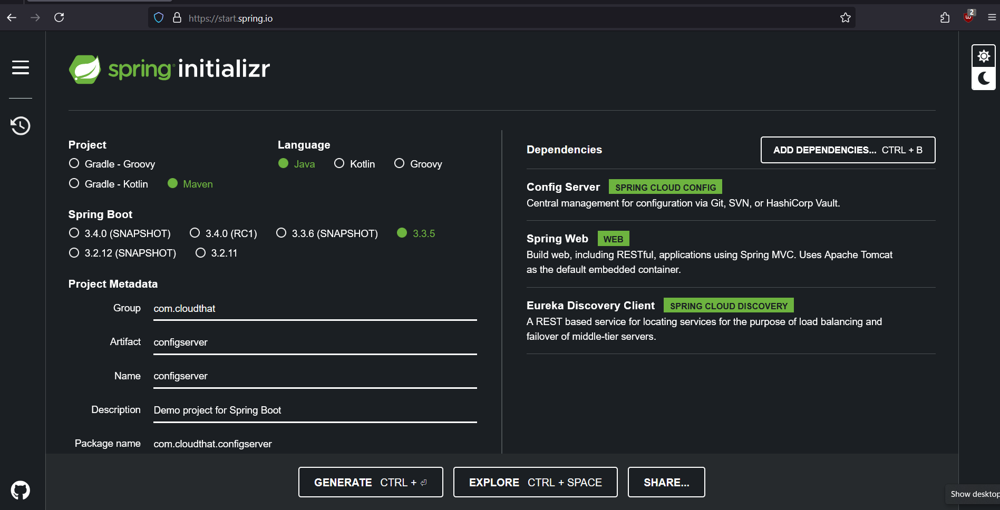
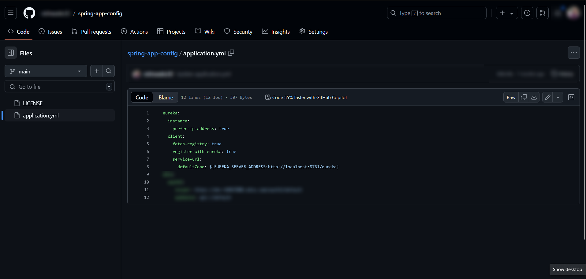
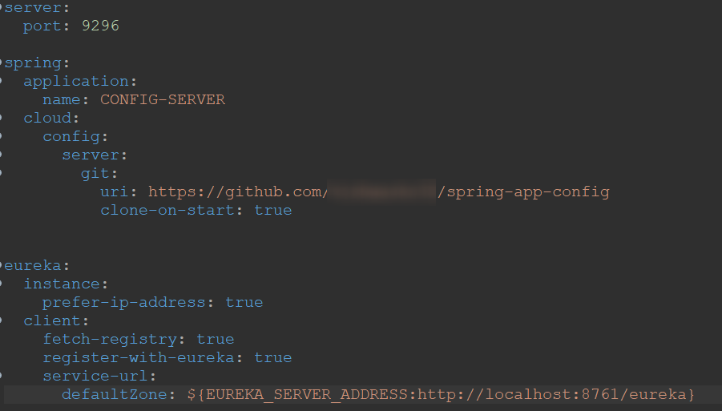
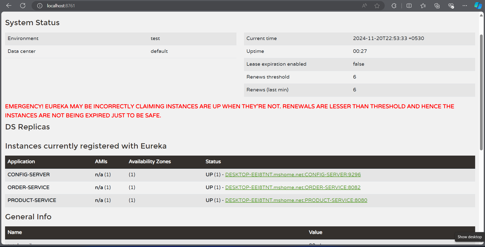

# Lab: Adding a configuration server & externalize config to github

## Tasks
### Task 1: Generating Template from spring initializer

* visit the [spring initializer](https://start.spring.io)
* Add the dependencies
  


### Task 2: Open the project in intellij
* Convert `application.properties` to `application.yaml` 

### Task 3: Enable Config Server
Add annotation `@EnableConfigServer` in `application.java`


### Task 4: Add the configuration to github



### Task 5: add the configuration to the application.yaml

* In the config Server microservice 



### Task 6: Adding config client in product and order service

```xml
<dependency>
    <groupId>org.springframework.cloud</groupId>
    <artifactId>spring-cloud-starter-config</artifactId>
</dependency>
```

* Then in application.yaml of product service and order service
* Remove/comment eureka configuration
* Add config server configuration
```yaml
spring:
    config:
        import: configserver:http://localhost:9296
```
* Then start service registry, config server and product service and order service

## Output:



Visit https://spring.io/guides/gs/centralized-configuration for more