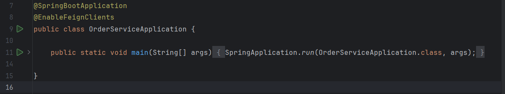
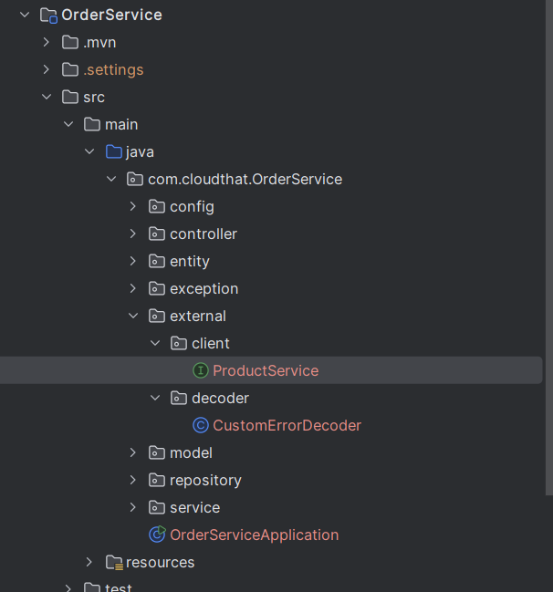
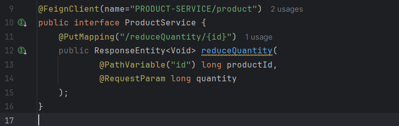

# Lab: Communication between order service and product service in Ecommerce App
Feign is a declarative web service client. It makes writing web service clients easier. To use Feign create an interface and annotate it. It has pluggable annotation support including Feign annotations and JAX-RS annotations. Feign also supports pluggable encoders and decoders. 
## Tasks
### Task 1: In the Order Service add the dependency open feign client

```xml
<dependency>
    <groupId>org.springframework.cloud</groupId>
    <artifactId>spring-cloud-starter-openfeign</artifactId>
</dependency>
```

### Task 2: Make Order Service as a open feign client



### Task 3: Adding Product service as external dependency

* In the orderService create a `external` package



### Task 4: In the interface product service add
* Implement Feign Client(Product Service) in Order service as an external.client package and create an interface
* Declare the method of product service which you are going to use
  



* Add the code to call reduce quantity when order is placed
* Add below code in orderserviceImpl
```java
   @Override
    public long placeOrder(OrderRequest orderRequest) {

        //Order Entity -> Save the data with Status Order Created
        //Product Service - Block Products (Reduce the Quantity)
        //Payment Service -> Payments -> Success-> COMPLETE, Else
        //CANCELLED

        log.info("Placing Order Request: {}", orderRequest);

        productService.reduceQuantity(orderRequest.getProductId(), orderRequest.getQuantity());

        log.info("Creating Order with Status CREATED");
        Order order = Order.builder()
                .amount(orderRequest.getTotalAmount())
                .orderStatus("CREATED")
                .productId(orderRequest.getProductId())
                .orderDate(Instant.now())
                .quantity(orderRequest.getQuantity())
                .build();

        order = orderRepository.save(order);

        log.info("Order Places successfully with Order Id: {}", order.getId());
        return order.getId();
    }
```
* Restart the order service
* Test the api using place order

