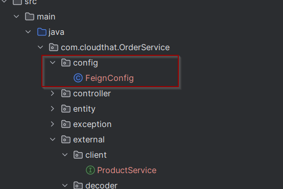
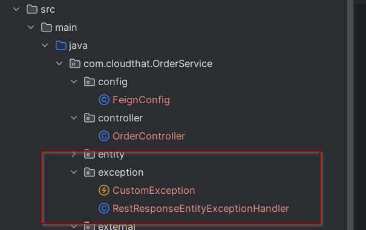

# Lab: Handling errors from one service to another in Eommerce App

## Tasks
### Task 1: In the external package – create a package decoder


### Task 2: Create a class custom error decoder which implements ErrorDecoder from feign client

```java
@Log4j2
public class CustomErrorDecoder implements ErrorDecoder {

    @Override
    public Exception decode(String s, Response response) {
        ObjectMapper objectMapper
                = new ObjectMapper();

        log.info("::{}",response.request().url());
        log.info("::{}",response.request().headers());

        try {
            ErrorResponse errorResponse
                    = objectMapper.readValue(response.body().asInputStream(),
                    ErrorResponse.class);

            return new CustomException(errorResponse.getErrorMessage() ,
                    errorResponse.getErrorCode(),
                    response.status());

        } catch (IOException e) {
            throw  new CustomException("Internal Server Error",
                    "INTERNAL_SERVER_ERROR",
                    500);
        }
    }
}
```

### Task 3: Add config to use custom error decoder instead of error decoder



```java
@Configuration
public class FeignConfig {

    @Bean
    ErrorDecoder errorDecoder() {
        return new CustomErrorDecoder();
    }
}
```

### Task 4: Adding Exception Handling in order service



* In `CustomException.java`
```java
@Data
public class CustomException extends RuntimeException{

    /**
	 * 
	 */
	private static final long serialVersionUID = 1L;
	private String errorCode;
    private int status;

    public CustomException(String message, String errorCode, int status) {
        super(message);
        this.errorCode = errorCode;
        this.status = status;
    }
}
```
* In `RestResponseEntityExceptionHandler.java`
```java
@ControllerAdvice
public class RestResponseEntityExceptionHandler extends ResponseEntityExceptionHandler {

    @ExceptionHandler(CustomException.class)
    public ResponseEntity<ErrorResponse> handleCustomException(CustomException exception) {
            return new ResponseEntity<ErrorResponse>(new ErrorResponse().builder()
                    .errorMessage(exception.getMessage())
                    .errorCode(exception.getErrorCode())
                    .build(),
                    HttpStatus.valueOf(exception.getStatus()));
    }
}
```

* Create a error response model
```java
@Data
@AllArgsConstructor
@NoArgsConstructor
@Builder
public class ErrorResponse {
    private String errorMessage;
    private String errorCode;
}

```