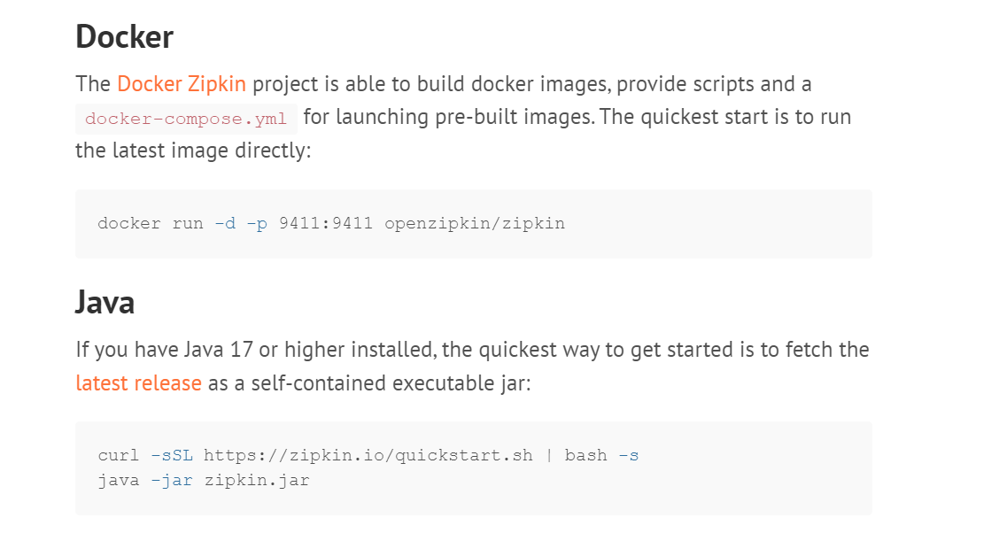
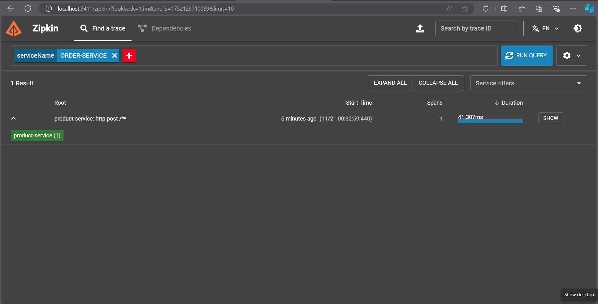

# Lab: Add zipkin tracing for Ecommerce Application

## Tasks

* Visit [zipkin quickstart](https://zipkin.io/pages/quickstart)
* You can use the docker version or java version



* Add Zipkin and Slueth(moved to micrometer from spring 3.0) Dependencies n order and product service

```xml
<dependency>
    <groupId>org.springframework.boot</groupId>
    <artifactId>spring-boot-starter-actuator</artifactId>
</dependency>
<dependency>
    <groupId>io.micrometer</groupId>
    <artifactId>micrometer-tracing-bridge-brave</artifactId>
</dependency>
<dependency>
    <groupId>io.zipkin.reporter2</groupId>
    <artifactId>zipkin-reporter-brave</artifactId>
</dependency>
```
You will be able to get trace using trace id and span id 


