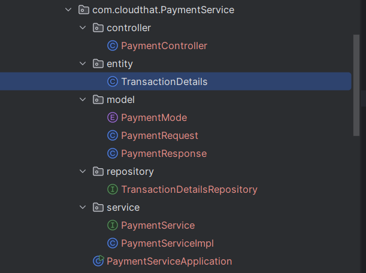
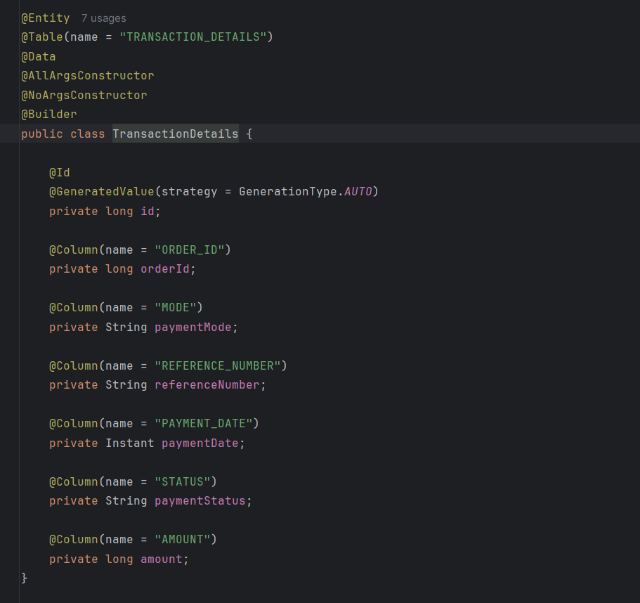
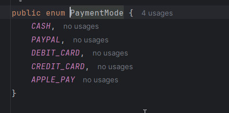
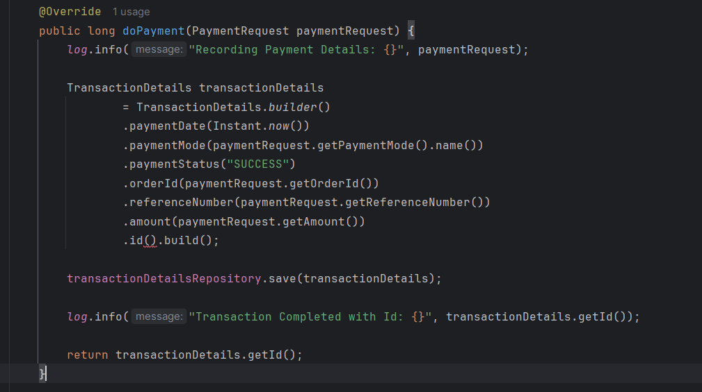
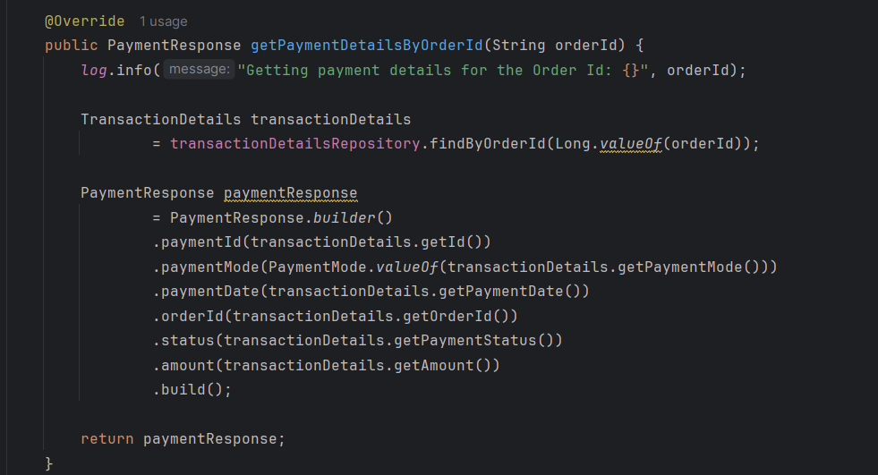

# Lab: Adding Payment service to Ecommerce App

## Tasks
### Task 1: Generating Template from spring initializer

* visit the [spring initializer](https://start.spring.io)
* Add the dependencies
  * Spring Web
  * Eureka Client
  * Lombok
  * Data JPA
  * Mysql
  * Cloud Bootstrap
  * zipkin

  

### Task 2: Open the project in intelliJ
* Convert `application.properties` to `application.yaml` 
* Set `server.port` to `8083`

### Task 3: Create Payment Service

* TransactionDetails Entity
  

* PaymentMode
  

* With methods doPayment 

* Get Payment details by order id

