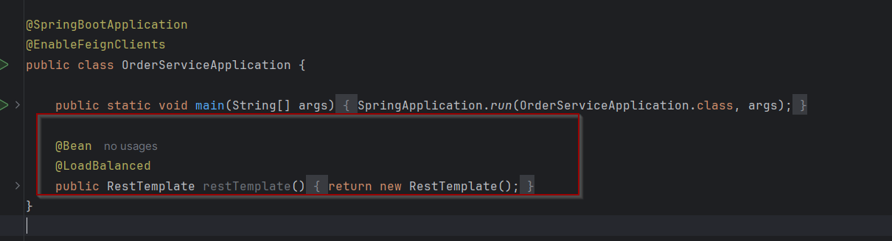
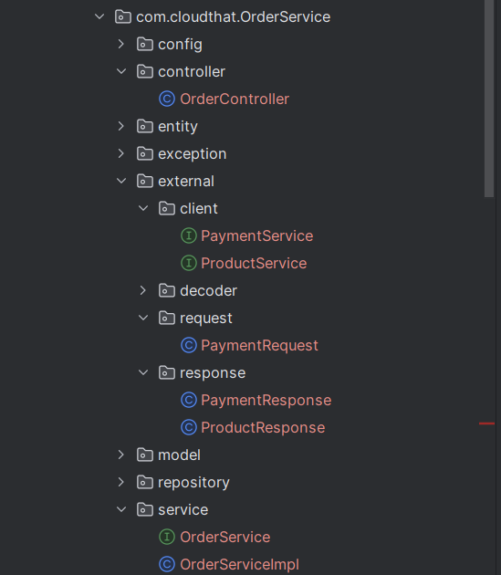

# Lab: Communication among services using RestTemplate

## Tasks
### Task 1: In the Service you want to fetch data `ORDER SERVICE`



### Task 2: In the external package
* Create Client



### Task 5: Create Payment service openfeign client

```java
@FeignClient(name = "PAYMENT-SERVICE/payment")
public interface PaymentService {

    @PostMapping
    public ResponseEntity<Long> doPayment(@RequestBody PaymentRequest paymentRequest);

    default ResponseEntity<Long> fallback(Exception e) {
        throw new CustomException("Payment Service is not available",
                "UNAVAILABLE",
                500);
    }
}

```
This can also be implemented using resttemplate `postforobject` or `postforentity`


   

### Task 4: Modify PlaceOrder Method to updated payment

```java
    @Override
    public long placeOrder(OrderRequest orderRequest) {

        //Order Entity -> Save the data with Status Order Created
        //Product Service - Block Products (Reduce the Quantity)
        //Payment Service -> Payments -> Success-> COMPLETE, Else
        //CANCELLED


        productService.reduceQuantity(orderRequest.getProductId(), orderRequest.getQuantity());


        Order order = Order.builder()
                .amount(orderRequest.getTotalAmount())
                .orderStatus("CREATED")
                .productId(orderRequest.getProductId())
                .orderDate(Instant.now())
                .quantity(orderRequest.getQuantity())
                .build();

        order = orderRepository.save(order);

               PaymentRequest paymentRequest
                = PaymentRequest.builder()
                .orderId(order.getId())
                .paymentMode(orderRequest.getPaymentMode())
                .amount(orderRequest.getTotalAmount())
                .build();

        String orderStatus = null;
        try {
            paymentService.doPayment(paymentRequest);

            orderStatus = "PLACED";
        } catch (Exception e) {

            orderStatus = "PAYMENT_FAILED";
        }
        order.setOrderStatus(orderStatus);
        orderRepository.save(order);


        return order.getId();
    }
```

### Task 5: Implement getorder details

```java
 public OrderResponse getOrderDetails(long orderId) {

        Order order
                = orderRepository.findById(orderId)
                .orElseThrow(() -> new CustomException("Order not found for the order Id:" + orderId,
                        "NOT_FOUND",
                        404));

   
        ProductResponse productResponse = restTemplate.getForObject("http://PRODUCT-SERVICE/product/" + order.getProductId(), ProductResponse.class);


        PaymentResponse paymentResponse
                = restTemplate.getForObject(
                        "http://PAYMENT-SERVICE/payment/order/" + order.getId(),
                PaymentResponse.class
                );

        OrderResponse.ProductDetails productDetails
                = OrderResponse.ProductDetails
                .builder()
                .productName(productResponse.getProductName())
                .productId(productResponse.getProductId())
                .build();

        OrderResponse.PaymentDetails paymentDetails
                = OrderResponse.PaymentDetails
                .builder()
                .paymentId(paymentResponse.getPaymentId())
                .paymentStatus(paymentResponse.getStatus())
                .paymentDate(paymentResponse.getPaymentDate())
                .paymentMode(paymentResponse.getPaymentMode())
                .build();

        OrderResponse orderResponse
                = OrderResponse.builder()
                .orderId(order.getId())
                .orderStatus(order.getOrderStatus())
                .amount(order.getAmount())
                .orderDate(order.getOrderDate())
                .productDetails(productDetails)
                .paymentDetails(paymentDetails)
                .build();

        return orderResponse;
    }
```

## Output
Test the endpoints with relevant details


Refer :
1. https://spring.io/guides/gs/consuming-rest
2. https://docs.spring.io/spring-framework/docs/current/javadoc-api/org/springframework/web/client/RestTemplate.html
3. https://www.springcloud.io/post/2022-03/spring-resttemplate/#gsc.tab=0