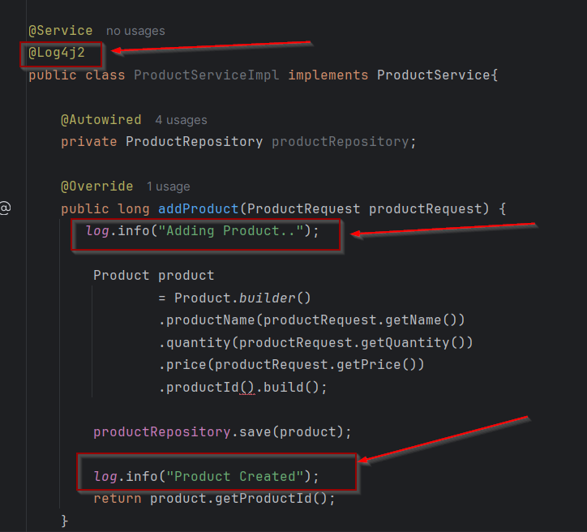
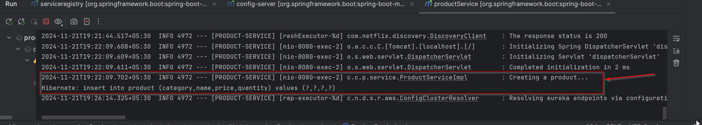

# Lab: Implementing Logging in Ecommerce Application

## Tasks
### Task 1: Enable Log4J2 in application

Since we had already included Lombok as dependency on our projects

use `@Log4j2` on ProductService, OrderService etc..

Example:     

### Task 2: Trigger endpoint

Trigger the endpoint in postman tool

## Output

View the log in terminal

Similarly add the log for info, debug, error whereever necessary in application which would be helpful for auditing.