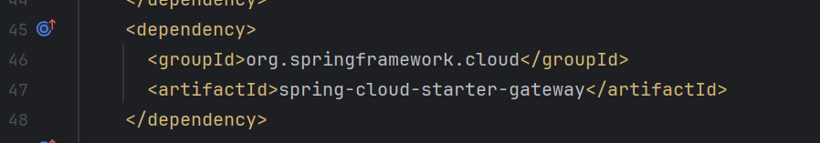

# Lab: Adding API Gateway t Ecommerce Application

## Tasks
### Task 1: Generate template

visit [spring starter](https://start.spring.io)

### Task 2: Add the dependencies

* cloud bootstrap, 
* gateway, 
* spring reactive web, 
* zipkin, 
* Lombok, 
* config client, 
* eureka client, 
* spring boot actuator


The above is a reactive gateway

### Task 3: Open in IntelliJ

* Convert from `application.properties` to `application.yml`
* Add the below configuration to `application.yml`

```yaml
server:
    port: 9090
spring:
    application:
        name: API-GATEWAY
    config:
        import: configserver:http://localhost:9296
```

### Task 4: Add the routes

```yaml

spring:
  application:
    name: API-GATEWAY
  config:
    import:
    - configserver:http://localhost:9296
  cloud:
    gateway:
      mvc:
        routes:
        - id : ORDER-SERVICE
          uri: lb://ORDER-SERVICE
          predicates:
            - Path=/order/**
          
        - id: PAYMENT-SERVICE
          uri: lb://PAYMENT-SERVICE
          predicates:
            - Path=/payment/**
          
        - id: PRODUCT-SERVICE
          uri: lb://PRODUCT-SERVICE
          predicates:
            - Path=/product/** 
    discovery:
        enabled: true
```
From now on change all routes to route from `localhost:9090`

