# Lab: Implementing Circuit Breaker
## Tasks
### Task 1: Adding dependency to cloud gateway

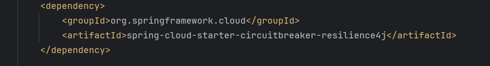

### Task 2: Add fallback uri

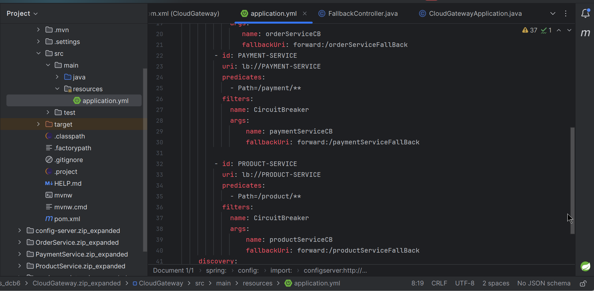

### Task 3: Implement Fallback controller

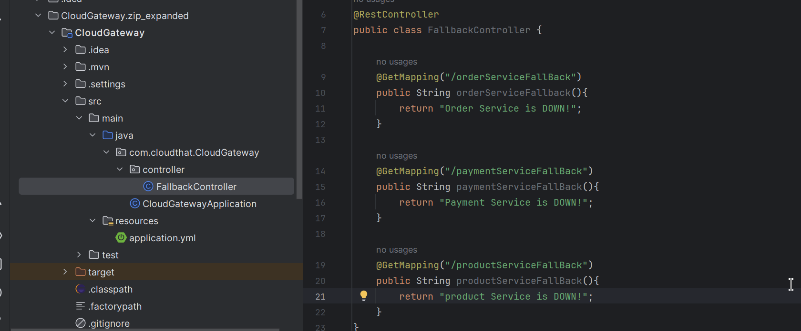

### Task 4: In cloudgateway – create bean for circuit breaker

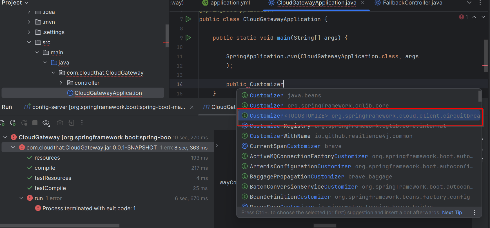

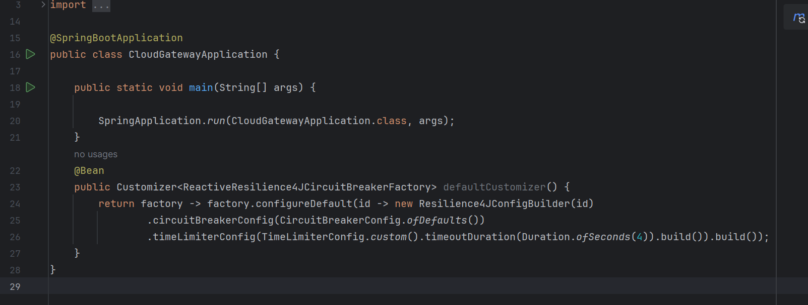

### Task 5: Adding Circuitbreaker

In Order service pom.xml add circuitbreaker dependency
In feign clients insert circuit breaker

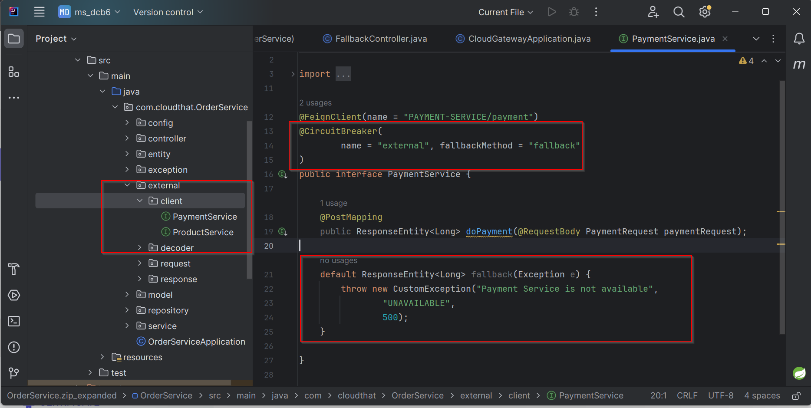

### Task 6: Add configuration in order service

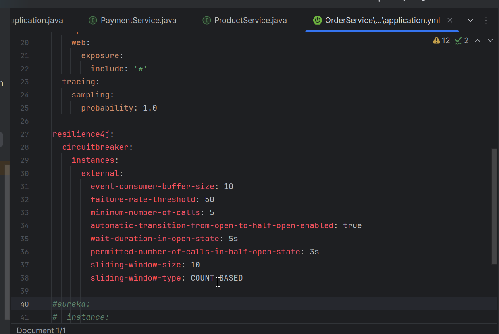

```yaml
resilience4j:
  circuitbreaker:
    instances:
      external:
        event-consumer-buffer-size: 10
        failure-rate-threshold: 50
        minimum-number-of-calls: 5
        automatic-transition-from-open-to-half-open-enabled: true
        wait-duration-in-open-state: 5s
        permitted-number-of-calls-in-half-open-state: 3
        sliding-window-size: 10
        sliding-window-type: COUNT_BASED
```

### Task 7: Implementing Rate Limiter 

* Implementing Rate Limiter using Redis and Resilience4J
* Download and start redis docker image
* Add dependency of reactive redis In cloud gateway

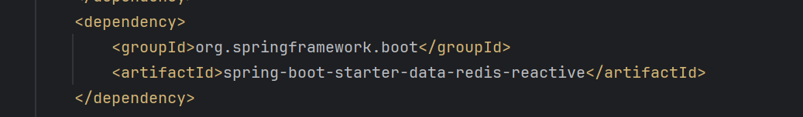

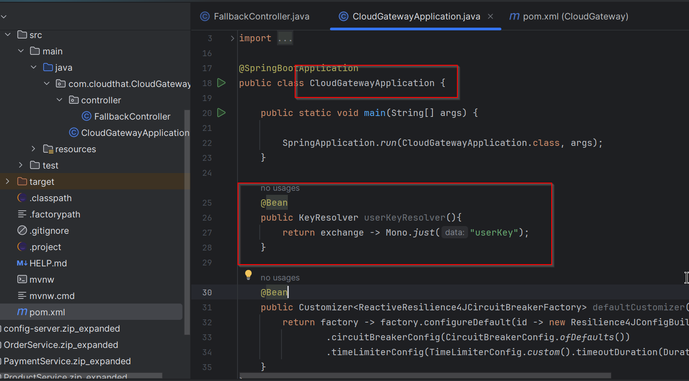

### Task 8: Add replenish rate and burst capacity

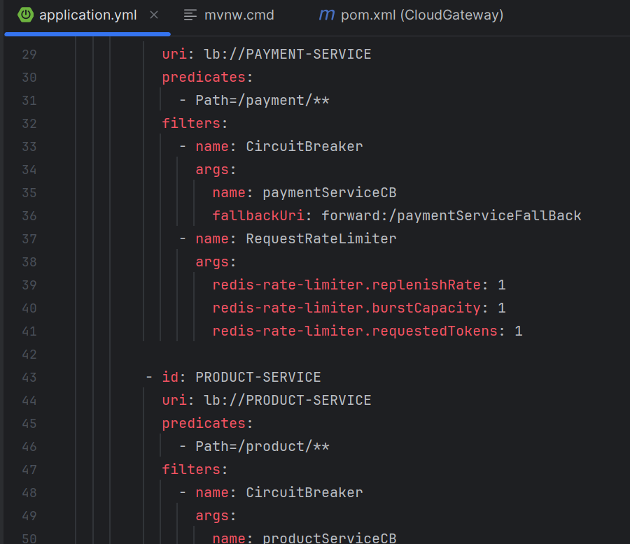

Add this for every service in cloud gateway

```yaml
        - id: PAYMENT-SERVICE
          uri: lb://PAYMENT-SERVICE
          predicates:
            - Path=/payment/**
          filters:
            - name: CircuitBreaker
              args:
                name: paymentServiceCB
                fallbackUri: forward:/paymentServiceFallBack
            - name: RequestRateLimiter
              args:
                redis-rate-limiter.replenishRate: 1
                redis-rate-limiter.burstCapacity: 1
                redis-rate-limiter.requestedTokens: 1
```

## Output:

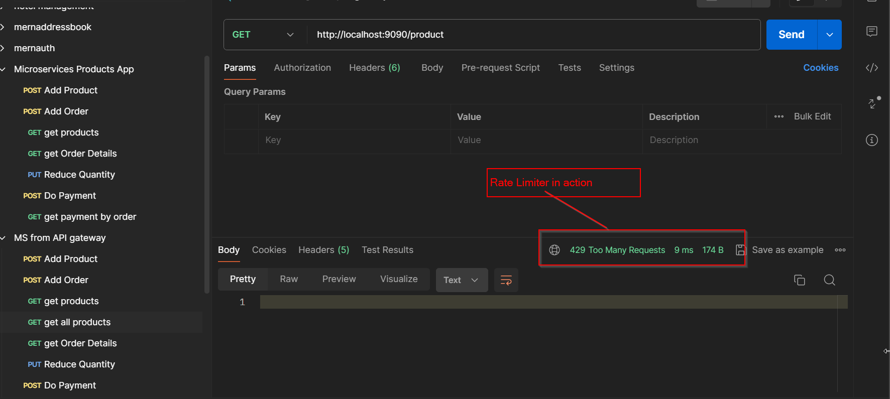


Refer
1. https://resilience4j.readme.io/docs/getting-started-3
2. https://spring.io/guides/gs/cloud-circuit-breaker
   